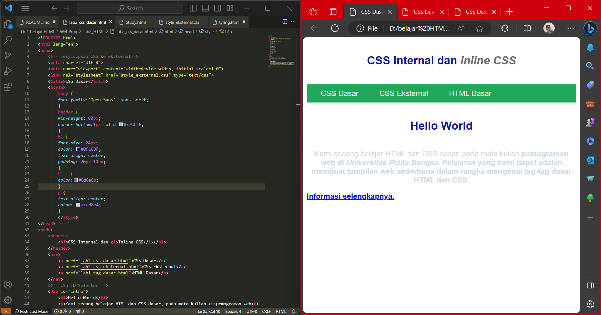
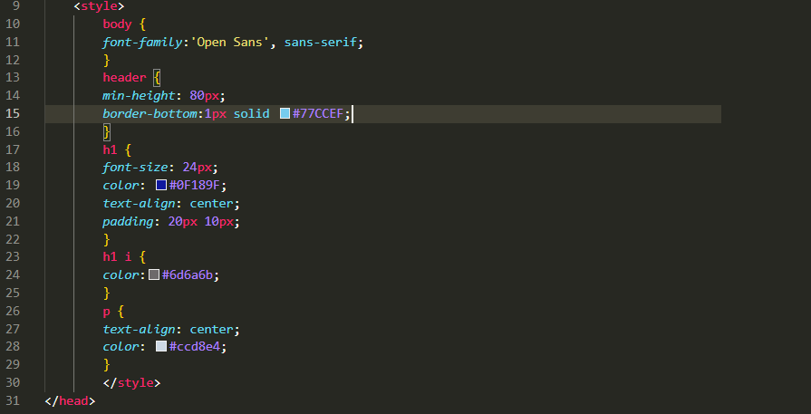
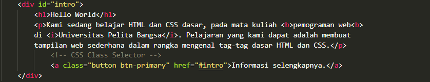
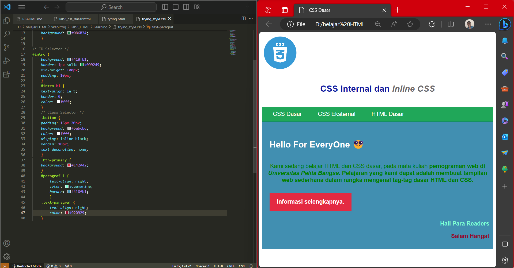

# Lab2_HTML 
|**Nama**|**NIM**|**Kelas**|**Matkul**|
|----|---|-----|------|
|Muhammad Fiqri Setyoadi|312210062|TI.22.A.2|Pemograman Web|

# CSS with HTML
1. Membuat dokumen HTML

2. Mendeklarasikan CSS Internal

3. Memanbahkan Inline CSS

4. Membuat CSS Eksternal

5. Menambahkan CSS Selector

# Pertanyaan dan Tugas
1. Lakukan eksperimen dengan mengubah dan menambah properti dan nilai pada kode CSS dengan mengacu pada CSS Cheat Sheet yang diberikan pada file terpisah dari modul ini.
2. Apa perbedaan pendeklarasian CSS elemen ``h1 {...}`` dengan ``#intro h1 {...}``? berikan penjelasannya!
3. Apabila ada deklarasi CSS secara internal, lalu ditambahkan CSS eksternal dan inline CSS pada elemen yang sama. Deklarasi manakah yang akan ditampilkan pada browser? Berikan penjelasan dan contohnya!
4. Pada sebuah elemen HTML terdapat ID dan Class, apabila masing-masing selector tersebut
terdapat deklarasi CSS, maka deklarasi manakah yang akan ditampilkan pada browser?
Berikan penjelasan dan contohnya! ``( 
 )``

## Jawaban
1. Disini saya akan menambahkan logo CSS tepat diatas tulisan "CSS Internal dan Inline CSS"

2.  ``h1 {...}``itu memberikan sebuah elemen atau style secara menyeluruh.
    
    ``#intro h1 {...}`` hanya memberikan sebuah style atau elemen yang ada dalam cakupan intro itu sendiri.
3. Deklarasi css internal, itu yg di dalam file html tag ``<style>``

    Eksternal, yg di file format css: 

    

    Inline, cssnya ada di  dalam tag:

    

4. Selector class adalah kebalikan dari ID, jika ID hanya dipakai sekalai dalam setiap halaman, CLASS merupakan selector yang dapat digunakan / dipanggil secara berulang-ulang.

    ini adalah contoh codenya pada file css beserta ouputnya:
    
    sedangkan yang ini adalah codenya yang ada di file htmlnya:
    

## Sekian dan Terimakasih 🙏, mohon maaf bila banyak kekurangan.